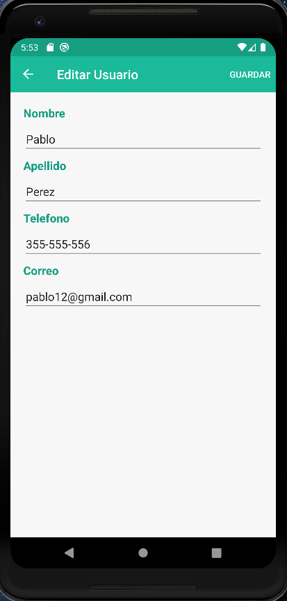
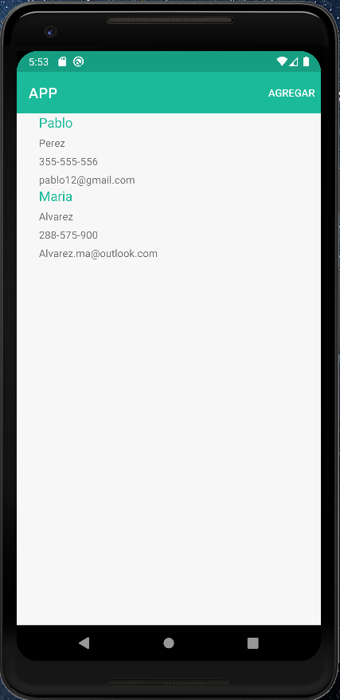

# Prueba_Xamarin
En este repositorio se encuantra el desarrollo de una APIRestFul. El backend fue desarrollado con APS.NET Core y se uso MySQL como base de datos. El frontend fue desarrollado con Xamarin.Forms, dirigido para dispositivos moviles Android.

Funciones de la app:
- Lista de los usuarios registrados
- Agregar, Editar y Borrar usuarios

ADVERTENCIA: Esta APP esta desarrollada para funcionar en un entorno de desarrollo local, la conexion a la API ha sido modificada para ignorar certificados SSL.

